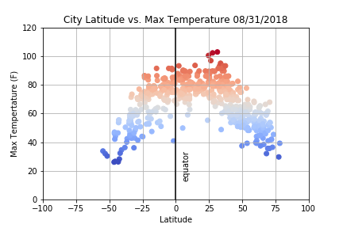
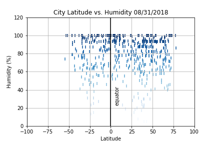

# python-api-homework
## Python API Homework

# City weather by latitude analysis

This assignment required us to do a weather analysis for 500+ cities spread across different latitudes to see how weather is impacted as compared to the distance of city from equator.

The first step in performing the analysis was to obtain the key to Weather API.
Once done, I got a list of random cities equally distributed over latitudes using the pip citipy.
Using the above list of cities I made API calls to OpenWeatherMap API and stored different weather indicators received through JSON response in a dataframe.
Using this dataframe, I plotted various scatter plots:

 




The observable `data trends` we can see using the above plots are:
-------------------------------------------------------------------------
```

1. The temperature is directly proportional to the distance of city from equator during this time of the year. 
2. One of the reason for this proportional distribution is that we are doing the analysis in August. If we were doing the same analysis in a June (summer in northern hemisphere and winter in southern hemisphere) or January (winter in northern hemisphere and summer in southern hemisphere), the trend might have differed.
3. The humidity/cloudiness is not truly dependent on distance from equator. We can see 100% humidity and cloudiness even in cities far away from equator.
4. There is no clear relationship between the wind speed and distance from equator as well.

```

